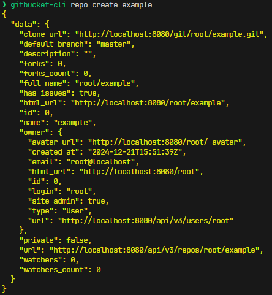

# GitBucket CLI

GitBucket CLI is a tool for seamless integration with GitBucket from the command line. You can use it to manipulate repositories, issues, organizations, etc.



## Table of Contents

- [Table of Contents](#table-of-contents)
- [Features](#features)
- [Motivation](#motivation)
- [Installation](#installation)
- [Usage](#usage)
- [Inspiration](#inspiration)
- [License](#license)

## Features

You can do the following from the command line.

* Create, retrieve, and clone repositories
* Create and retrieve organizations
* Create and retrieve labels for repositories
* Create and retrieve issues in repositories

## Motivation

I use GitHub in my private life, but I use [GitBucket](https://github.com/gitbucket/gitbucket) at work. GitBucket does not have a tool such as [gh](https://github.com/cli/cli) that allows seamless command line integration. For example, if I want to create a repository, I usually need to use a browser. Fortunately, GitBucket has [some APIs](https://github.com/gitbucket/gitbucket/wiki/API-WebHook), so I thought it would be possible to operate from the command line using those APIs.

## Installation

`go install github.com/guitarinchen/gitbucket-cli@latest`

## Usage

### Setup

- Generate personal access token on GitBucket (`Account settings` > `Applications`)
- Set environment variables
  ```sh
  # It is recommended that these are set in ~/.bashrc or ~/.zshrc.
  export GITBUCKET_API_TOKEN="<generated_token>"
  export GITBUCKET_API_BASE_URL="https://<your_gitbucket_domain>/api/v3"
  ```

### Execute

#### Create a repository

`gitbucket-cli repo create <repository_name>`

#### Show help

`gitbucket-cli --help`

## Inspiration

* [gh](https://github.com/cli/cli)

## License

[MIT License](./LICENSE)
